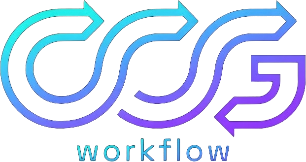
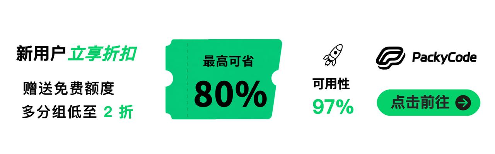

# CCG - Claude Code + GPT + Grok 协作

<div align="center">



[](https://github.com/Pyrokine/ccg-workflow)
[](https://github.com/Pyrokine/ccg-workflow/actions/workflows/ci.yml)
[](https://github.com/Pyrokine/ccg-workflow/releases)
[](https://opensource.org/licenses/MIT)
[](https://claude.ai/code)
[](#)

简体中文 | [English](./README.md)

</div>

## ♥️ Sponsor

[](https://www.packyapi.ai/register?aff=m21P)

[PackyCode](https://www.packyapi.ai/register?aff=m21P) 通过同一域名和 API key 提供 Claude Code 与 Codex 专用通道；安装器可配置 Claude Code，并在不改变当前 active provider 的情况下注册 Codex provider

---

[](https://go.apimart.ai/gh-ccg-workflow)

[APIMart](https://go.apimart.ai/gh-ccg-workflow) 赞助本项目，并提供图片、视频、Claude 和 GPT API；安装器可将其
Anthropic 兼容端点配置为 Claude Code API 提供方，也可单独注册 Codex provider，是否激活由用户明确选择

---

[](https://notebooklmremover.org)

[NotebookLM Remover](https://notebooklmremover.org) — 免费浏览器本地 AI 水印去除工具。支持视频、PDF、PPTX、信息图、播客等全格式，100%
隐私，离线可用。

---

## DeepSeek Harness 版 CCG：`dsh-ccg`

内置的 `dsh-ccg` 插件将同一套角色矩阵带入
[DeepSeek Harness](https://github.com/deepseek-ai/deepseek-harness)。安装器使用当前 `DSH_HOME`，把插件复制到长期保留的本地路径，并且只修改用户选定的 profile manifest。

```bash
node bin/ccg.mjs dsh install                # 安装到所有已发现的 profile
node bin/ccg.mjs dsh install --profile web  # 只安装到一个 profile
node bin/ccg.mjs dsh list
node bin/ccg.mjs dsh uninstall
```

角色工具、模型面板和常驻队友说明见 [`dsh-ccg/README.zh-CN.md`](./dsh-ccg/README.zh-CN.md)。

---

CCG 是 Claude Code 的工作流引擎。默认前端、后端和审查都使用独立 Claude Code Agent。Codex、Antigravity、Grok、Kimi Code、OpenCode 与 GPT/Grok 外部审查只在用户明确请求时运行。

Gemini CLI 已禁用：2026-06-18 后 consumer OAuth 请求不再处理。旧 Gemini 路由迁移为 Grok，`agy` 保留为 Antigravity 别名。

## v3.6.7-aug.1 更新

- package tarball 改用明确的 skill 子目录白名单并排除 `templates/skills/domains/security/`；红队和渗透参考笔记仍保留在 Git 中，默认安装也继续排除该目录
- PackyCode 与 APIMart 进入共享 sponsor registry，init、API 菜单、Codex mode 和卸载使用同一配置来源
- Codex mode 只在现有 `~/.codex/AGENTS.md` 中合并一个 managed block，在保留用户 Hook 的前提下注册一个 `UserPromptSubmit` command，并在安装前备份；任一安装步骤失败时恢复全部目标文件；ownership manifest 会在卸载时恢复安装前已有的同名 runtime 文件，并保留安装后的用户修改
- sponsor Codex provider 只做增量注册，不覆盖用户已有 provider table、认证或配置权限，只有用户明确选择时才激活；卸载只移除本次 Codex mode 安装新增的 provider table；沿用当前 Codex 的稳定 Hook 和 multi-agent 默认值，不再强制写入过时的 `multi_agent_v2` timeout table
- GPT 审查保持 `gpt-5.6-sol / xhigh`；Grok 审查默认升级为 `grok-4.6 / high`，安装时迁移精确的 `grok-4.5` 旧默认值
- Claude Code 可从当前仓库以原生 plugin 方式安装技能包；完整多模型工作流仍由安装器提供
- 新增 `bt-panel`、`seo-page-builder` 和 `adsense-site-auditor` 三个 Web 运维技能
- `frontend-design` 成为唯一直接设计入口，内部使用 20 个 Impeccable playbook
- `dsh-ccg` 可安装到 DeepSeek Harness profile，并尊重 `DSH_HOME`
- Codex sub-agent 默认不启动 MCP；`/ccg:codex-exec` 只为需要检索的 executor 显式开启
- task controller 会在每次用户输入和前台外部结果返回后刷新精确规范权威

## v3.0 重大更新

v3.0 从底层重写。一个命令替代 29 个。

- `/ccg:go` — 用自然语言描述任务，引擎自动分析意图、选择策略、执行到底。
- **Hook 引擎** — 用户消息只注入限长任务摘要；startup、resume、clear 和 compact 恢复当前 session 的完整任务契约、artifact 与精确关联的 spec section；fork 使用新的未绑定 session identity。
- **Task 持久化** — 每个 worktree 保存共享 task 和 opaque per-session binding。durable status 仍为 `open`、`completed`、`cancelled`；当前 session 认领的 open task 对外显示 `in_progress`。state、binding、task 三层 revision 拒绝过期并发写入。
- **Agent Teams** — 大型任务通过 TeamCreate 并行 spawn 多个 Builder。每个 Builder 有独立文件所有权。
- **质量关卡** — `ccg:verify-security`、`ccg:verify-quality`、`ccg:verify-change` 作为 Skill 在策略验证阶段强制调用。
- **域知识 Hook** — 消息涉及安全、缓存、RAG 等关键词时，相关知识文件自动注入上下文。
- **模型路由** — 前端与后端默认使用独立 Claude Code Agent。Codex、Antigravity、Grok、Kimi Code 和 OpenCode 是显式可选路由。Grok、Kimi Code 和 OpenCode CLI 路由可分别设置可选型号。
- **交叉审查** — 用户明确请求 GPT、Grok、双模型审查或 `/ccg:spec-review` 时，GPT、Grok 通过当前配置的 Claude Code provider 运行独立且不持久化的 print 会话。`routing.review.profiles` 独立配置它们在 provider 侧使用的型号和 effort，不受 Grok CLI 路由型号影响。
- **纯 Claude Code 模式** — 默认模式。独立 Claude Code Agent 或 Agent Teams 处理前端、后端和审查，不调用外部 CLI。
- **Codex 主导模式** — 用户明确选择时使用 Codex CLI 作为主导编排者。通过菜单 `X` 选项安装。

## 快速开始

```bash
git clone https://github.com/Pyrokine/ccg-workflow.git
cd ccg-workflow
corepack enable
pnpm install --frozen-lockfile
pnpm build
node bin/ccg.mjs
```

需要 Node.js 22.13+ 或 24.19.0+ 和 Claude Code CLI。Codex CLI、Antigravity CLI、Grok CLI、Kimi Code CLI 和 OpenCode CLI 仅在前端或后端路由时可选使用。

安装器 4 步：API 配置 → 模型路由 → MCP 工具 → 性能模式。新用户有精简流程，默认值开箱即用。

## 工作原理

```
你: /ccg:go 给这个 API 加 JWT 认证

CCG 引擎:
  1. 读取项目上下文（git、技术栈、文件结构）
  2. 分类: feature / L 复杂度 / backend / high 风险
  3. 选择策略: full-collaborate
  4. 创建 .ccg/state.json、当前 session binding 和 .ccg/tasks/add-jwt-auth/
  5. 写入完整 requirements 契约，并关联 tracked 文档中的精确 spec section
  6. 需要双视角时并行启动独立 Claude Code 分析 Agent
  7. 产出计划 → HARD STOP 等待审批
  8. 向 Builder 派发 task ID、revision、文件范围和 authoritative spec
  9. 执行质量关卡与独立 Claude Code 审查，记录最终检查点

只有用户明确请求时才调用外部 CLI 或 GPT、Grok 交叉审查。

每轮 Hook 注入:
  <ccg-state>
  Task: add-jwt-auth [add-jwt-auth]
  Status: in_progress
  Strategy: full-collaborate
  Phase: 4-implementation
  Next: Layer 1 Builders 执行中
  Revision: state=3, binding=1, task=7
  </ccg-state>
```

## 策略体系

引擎根据任务类型和复杂度自动选择策略：

| 策略              | 场景                | 外部模型       | Teams |
| ----------------- | ------------------- | -------------- | ----- |
| direct-fix        | 简单 bug，单文件    | 无             | 无    |
| quick-implement   | 小功能，范围清晰    | 无             | 无    |
| guided-develop    | 中等功能，需要规划  | 仅显式路由     | 无    |
| full-collaborate  | 复杂功能，跨模块    | 仅显式路由     | 强制  |
| debug-investigate | 复杂 bug，原因不明  | 仅显式路由     | 无    |
| refactor-safely   | 代码重构            | 仅显式外部审查 | 无    |
| deep-research     | 技术研究、方案对比  | 仅显式路由     | 无    |
| optimize-measure  | 性能优化            | 可选           | 无    |
| review-audit      | 代码审查            | 仅显式外部审查 | 无    |
| git-action        | commit、rollback 等 | 无             | 无    |

简单任务零开销快速执行。复杂任务启动完整引擎。

## 命令

v3.0 默认安装 12 个核心命令。Legacy 模式额外安装 18 个。

### 核心

| 命令      | 说明                              |
| --------- | --------------------------------- |
| `/ccg:go` | 智能入口 — 描述任务，引擎自动处理 |

### Git 工具

| 命令                  | 说明                     |
| --------------------- | ------------------------ |
| `/ccg:commit`         | 智能 conventional commit |
| `/ccg:rollback`       | 交互式回滚               |
| `/ccg:clean-branches` | 清理已合并分支           |
| `/ccg:worktree`       | Worktree 管理            |

### 项目

| 命令           | 说明                 |
| -------------- | -------------------- |
| `/ccg:init`    | 初始化项目 CLAUDE.md |
| `/ccg:context` | 项目上下文管理       |

### OpenSpec

| 命令                 | 说明               |
| -------------------- | ------------------ |
| `/ccg:spec-init`     | 初始化 OPSX 环境   |
| `/ccg:spec-research` | 需求 → 约束集      |
| `/ccg:spec-plan`     | 零决策可执行计划   |
| `/ccg:spec-impl`     | 按规范实施         |
| `/ccg:spec-review`   | GPT、Grok 交叉审查 |

## Hook 引擎

CCG 安装 CommonJS Hook runtime，并在 `~/.claude/settings.json` 的五类 Hook event 中注册四个处理脚本：

| Hook                  | 事件                                                    | 作用                                                                         |
| --------------------- | ------------------------------------------------------- | ---------------------------------------------------------------------------- |
| `workflow-state.js`   | `UserPromptSubmit`、`PostToolUse`、`PostToolUseFailure` | 每次输入及前台外部结果返回后刷新精确权威                                     |
| `session-start.js`    | `SessionStart`                                          | 在 startup、resume、clear、compact、fork 时恢复完整任务 snapshot             |
| `subagent-context.js` | Bash/Agent 的 `PreToolUse`                              | 修改实际 Agent prompt 或 wrapper heredoc，注入按角色匹配的任务与 spec 上下文 |
| `skill-router.js`     | `UserPromptSubmit`                                      | 注入命中的领域知识                                                           |

`SessionStart` 从 Claude Code `session_id` 派生 opaque key，并通过 `CLAUDE_ENV_FILE` 导出。所有 controller 调用和 authority refresh 都使用该 key。Agent prompt 与 wrapper heredoc 继承父 Claude session binding；原始 session ID 不写入 state、binding 或 turn 文件。

`task-state.js` 是唯一允许修改任务生命周期的入口。Hook 输入、任务文件和 spec section 都有大小限制。任务状态无效、权威上下文缺失或超限、quoted heredoc 无法绑定到 wrapper command 时，`PreToolUse` Hook 返回 `permissionDecision: "deny"`，Agent 或 wrapper 不会在缺少任务契约的情况下启动。

## Task 系统

持久策略使用 worktree 共享 task 和 session-scoped active binding：

```text
.ccg/
├── state.json                    # stateId 与共享结构 revision，不含 active pointer
├── sessions/
│   └── claude-<sha256>.json      # 当前 session 的 activeTaskId 与 binding revision
├── state.lock                    # 生命周期写入的短期文件锁
├── transaction.json             # 多文件修改待恢复时存在
├── tasks/
│   └── add-jwt-auth/
│       ├── task.json             # open/completed/cancelled、task revision、phase、gate、specRefs
│       ├── requirements.md       # 必需的任务契约
│       ├── progress.md           # 最后成功检查点和下一动作
│       ├── analysis.md           # 可选分析
│       ├── plan.md               # 可选审批计划
│       ├── review.md             # 可选审查结果
│       └── research/             # 可选研究成果
├── migrations/                   # state 与 legacy task 的字节级备份
└── historical-artifacts/orphans/ # 无 task.json 目录的可逆隔离区
```

Task 文件只持久化 `open`、`completed` 或 `cancelled`。当前 session binding 指向 open task 时，resolver 返回 effective `in_progress`；其他 open task 显示 `suspended`。一个 open task 默认只由一个 session 认领，其 open `returnToTaskId` 链也属于同一 claim。选择已占用任务返回 `TASK_CLAIMED`，只有显式 takeover 才转移 binding。完成或恢复任务只修改调用 session 的 binding。state、binding、task 三层 compare-and-swap revision 拒绝过期写入；多文件修改会保留可重放的 transaction marker，直到全部原子替换完成。

当前 session 没有 binding 但仍有 open task 时，控制器只返回候选元数据并要求显式选择。它不返回其他 session key，也不向当前 session 注入其他任务的 requirements、spec 或 artifact。这属于任务路由隔离，不是同一操作系统用户下的文件系统保密边界。

Schema v1 state、legacy task、有证据的无效状态和 orphan directory 分别使用显式迁移、修复与 quarantine 操作。旧 global pointer 只保留为重新认领提示，不自动分配。unfinished legacy task 保持 open；orphan directory 仅做 rename，不读取内容或推断 lifecycle。运行态父路径必须是 worktree 内的普通目录，symlink 会被拒绝。分支名和目录时间只用于诊断，不能选择任务。

## 规范权威

任务通过结构化 `specRefs` 关联 tracked 或 staged Markdown 的精确 section：

```json
{
  "path": "docs/integration-version-map.md",
  "section": "Merge and dependency rules",
  "purpose": "定义哪些仓库合入，哪些由构建系统引用",
  "roles": ["research", "implement", "review", "debug"]
}
```

Hook 验证项目相对路径、普通文件、literal Git 跟踪状态、fenced code block 之外的唯一精确 heading、完整且限长的 section、全部关联内容的上下文预算、角色和项目根边界。精确 spec section 与 `requirements.md` 先于可选任务 artifact 渲染，最终 32 KiB 限制不会删掉权威来源。系统不再扫描整个规范目录，也不再使用隐式 `.ccg/spec/` 模板。

执行依据从高到低为：精确关联的 spec section、`requirements.md`、用户当前明确指令、已审批的 `plan.md`、`progress.md`、compact 摘要或模型推断。compact/resume 和外部模型返回后，Lead 必须重新 resolve，并逐字段核对实体、版本、依赖方向、排除项和验收标准。

## 本地与共享上下文

| 路径                                   | 范围                                          |
| -------------------------------------- | --------------------------------------------- |
| `.ccg/`                                | 当前 worktree 的本地运行态，由 Git 忽略       |
| `.context/current/`                    | 本地会话备注，由 Git 忽略                     |
| `.context/prefs/`、`.context/history/` | Git 跟踪的团队规范和已脱敏决策历史            |
| 项目文档、OpenSpec                     | Git 跟踪的共享规范，由任务按精确 section 关联 |

## 技能包

安装器和 Claude Code 原生 plugin 都提供以下直接入口：

| 技能                        | 用途                                                 |
| --------------------------- | ---------------------------------------------------- |
| `/ccg:frontend-design`      | 前端设计入口，内部包含 20 个 Impeccable playbook     |
| `/ccg:bt-panel`             | 通过宝塔/aaPanel HTTP API 部署和管理站点             |
| `/ccg:seo-page-builder`     | 创建和审计 SEO 工具页，附可执行的 on-page audit 脚本 |
| `/ccg:adsense-site-auditor` | 检查 AdSense 申请准备情况和政策要求                  |

只从当前仓库安装技能包：

```bash
claude plugin marketplace add Pyrokine/ccg-workflow
claude plugin install ccg@ccg
```

原生 plugin 不安装 wrapper binary，也不安装带模板占位符的多模型工作流命令。

## CLI 命令

```bash
node bin/ccg.mjs doctor                   # 环境健康检查
node bin/ccg.mjs status                   # 安装状态和当前 session task 概览
node bin/ccg.mjs codex-mode install       # 安装 Codex 主导模式
node bin/ccg.mjs codex-mode uninstall     # 卸载 Codex 主导模式
node bin/ccg.mjs dsh install              # 安装 dsh-ccg
node bin/ccg.mjs dsh list                 # 查看 DSH profile 状态
node bin/ccg.mjs dsh uninstall            # 卸载 dsh-ccg
node bin/ccg.mjs uninstall                # 卸载 CCG
```

## 配置

```
~/.claude/
├── commands/ccg/          # 斜杠命令
├── hooks/ccg/             # Task controller、共享工具、4 个处理脚本、5 类 event
├── .ccg/
│   ├── config.toml        # 模型路由、MCP、性能
│   ├── engine/            # 策略文件 + 模型路由器
│   └── prompts/           # 专家提示词
├── skills/ccg/            # 质量关卡 + 域知识
└── bin/codeagent-wrapper  # 多模型执行桥
```

### 环境变量

在 `~/.claude/settings.json` 的 `"env"` 中设置：

| 变量                                   | 默认值   | 说明                                           |
| -------------------------------------- | -------- | ---------------------------------------------- |
| `CODEX_TIMEOUT`                        | `7200`   | Wrapper 超时（秒）                             |
| `CODEAGENT_POST_MESSAGE_DELAY`         | `5`      | 后端完成后的等待时间（秒）                     |
| `APIMART_API_KEY`                      | 未设置   | 选择 APIMart Codex provider 时使用的 API key   |
| `PACKYCODE_API_KEY`                    | 未设置   | 选择 PackyCode Codex provider 时使用的 API key |
| `DSH_HOME`                             | `~/.dsh` | `dsh-ccg` 使用的 DeepSeek Harness home         |
| `CLAUDE_CODE_EXPERIMENTAL_AGENT_TEAMS` | 未设置   | 设为 `1` 启用 Agent Teams 并行                 |

## 更新 / 卸载

```bash
git pull --ff-only
pnpm install --frozen-lockfile
pnpm build
node bin/ccg.mjs            # 需要卸载时在菜单中选择“卸载”
```

## 致谢

- [fengshao1227/ccg-workflow](https://github.com/fengshao1227/ccg-workflow) — 上游项目
- [cexll/myclaude](https://github.com/cexll/myclaude) — codeagent-wrapper 灵感
- [UfoMiao/zcf](https://github.com/UfoMiao/zcf) — Git 工具参考
- [mindfold-ai/Trellis](https://github.com/mindfold-ai/Trellis) — Hook 工作流状态模式
- [ace-tool](https://linux.do/t/topic/1344562) — MCP 代码检索

## 贡献者

<!-- readme: contributors -start -->
<table>
<tr>
    <td align="center"><a href="https://github.com/fengshao1227"><br /><sub><b>fengshao1227</b></sub></a></td>
    <td align="center"><a href="https://github.com/SXP-Simon"><br /><sub><b>SXP-Simon</b></sub></a></td>
    <td align="center"><a href="https://github.com/RebornQ"><br /><sub><b>RebornQ</b></sub></a></td>
    <td align="center"><a href="https://github.com/Sakuranda"><br /><sub><b>Sakuranda</b></sub></a></td>
    <td align="center"><a href="https://github.com/Mriris"><br /><sub><b>Mriris</b></sub></a></td>
    <td align="center"><a href="https://github.com/23q3"><br /><sub><b>23q3</b></sub></a></td>
    <td align="center"><a href="https://github.com/MrNine-666"><br /><sub><b>MrNine-666</b></sub></a></td>
</tr>
<tr>
    <td align="center"><a href="https://github.com/GGzili"><br /><sub><b>GGzili</b></sub></a></td>
</tr>
</table>
<!-- readme: contributors -end -->

## 项目链接

- [Issues](https://github.com/Pyrokine/ccg-workflow/issues)
- [Releases](https://github.com/Pyrokine/ccg-workflow/releases)
- [上游项目](https://github.com/fengshao1227/ccg-workflow)

## License

MIT

---

v3.6.7-aug.1 | [Issues](https://github.com/Pyrokine/ccg-workflow/issues) | [Contributing](./CONTRIBUTING.md) | [Releasing](./RELEASING.md)
